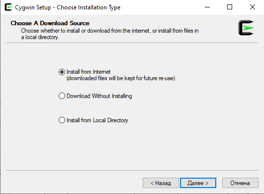
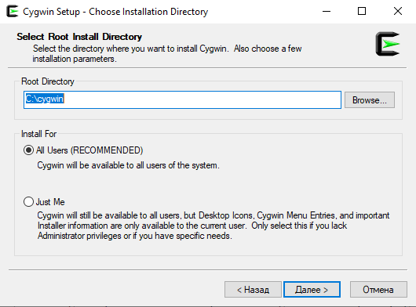
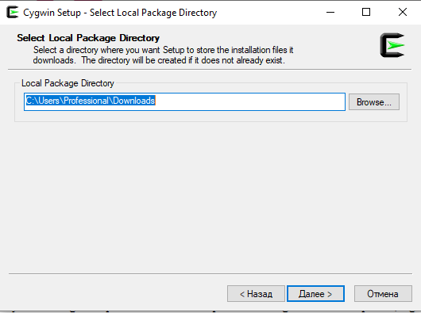
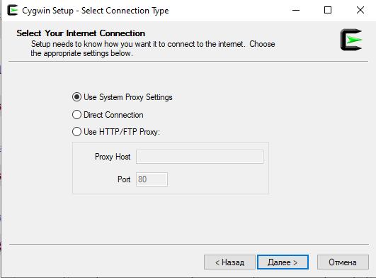
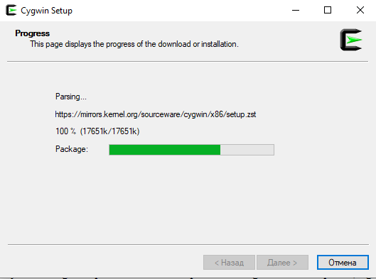
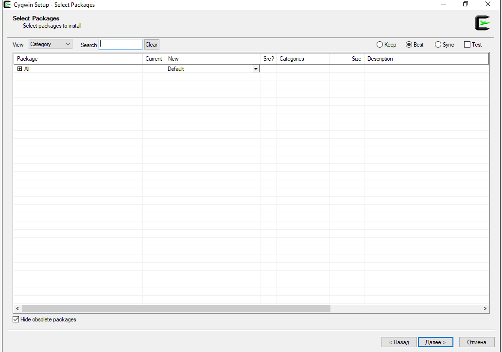
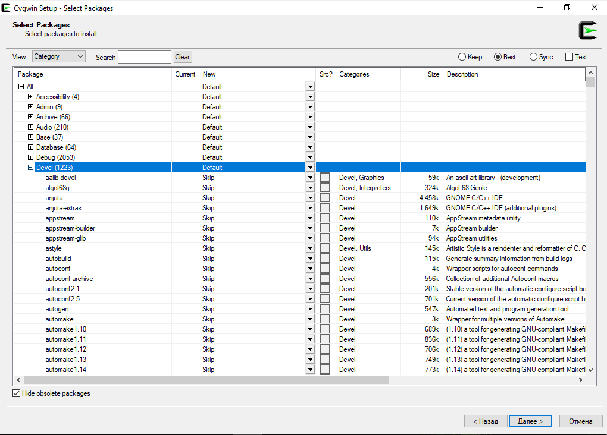
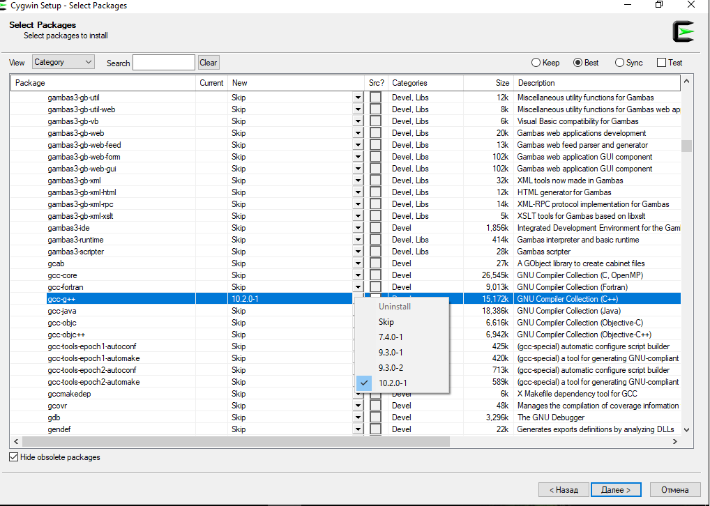
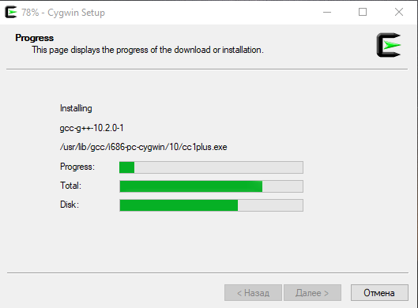

### ПЕТР СЕМИЛЕТОВ

### ПРОСТО С++: УРОК 2

   Итак, мы собрались при помощи топора построить дом, вернее - вооружившись обычным текстовым редактором начать писать программы на самом, как некоторые считают, сложном, и самом - а вот это уже правда - крутом языке программирования - С++.

   В прошлой серии мы сошлись на том, что нам нужна еще одна штука - какой-нибудь компилятор (сompiler). Компиляторы это такие программы, которые, напомню, переводят текст программы с языка высокого уровня на язык более низкого уровня, вплоть до машинных кодов - пронумерованных команд для процессора. Скажу упрощенно и пропуская многую подковёрную работу - компилятор превратит текст программы, написанной на С++, в исполняемый файл. Который состоит из машинных кодов.

   Компиляторы есть для разных языков, например для Паскаля, или языка Си, но нас интересуют компиляторы для С++. Таковых популярных три. Один это майкрософтовский Visual C++. Второй Clang, который вырос под крылом Apple. Наконец третий - мой любимый - GCC, некоммерческий плод созидательной мысли независимых разработчиков со всего мира. Дело выбора, но этот курс С++ я основываю именно на последнем, на GCC.

   Значит, его нужно установить. Если вы пользуетесь Линуксом, то наверное знаете, как это сделать - пойдите в менеджер пакетов и установите GCC, если он еще не установлен. 

Да, чуть не забыл - GCC - это целый набор разных компиляторов, в него входят компиляторы Си, Фортрана и других языков, так вот если GCC в вашем дистрибутиве Линукс разбит на отдельные пакеты, то обратите внимание, чтобы был отмечен к установке пакет, где в названии есть cpp или g++. CPP это общепринятое сокращение от C Plus Plus, а g++, именно "g" (от проекта GNU) - название компилятора С++ в составе набора компиляторов GCC.

   Но когда речь заходит о разработке программы на С++ и использовании компилятора этого языка из набора компиляторов GCC, то обычно так и говорят, GCC, а не g++.

   Пользователи операционной системы Windows, как вы поняли, GCC - гость из мира UNIX-систем, большей частью из Линукса, однако он существует и в вариантах под Windows. 

   Кстати, что такое операционная система? С точки зрения пользователя, это программа, которая позволяет пользователю нажимать на ярлыки и запускать другие программы. А с точки зрения программиста, операционка это программа, предоставляющая другим программам разные функции - например, удобный доступ к оперативной памяти, к экрану, клавиатуре, мыши, звуковой карте и так далее. Программа, написанная на языке высокого уровня, крайне редко общается с железом напрямую. Вместо этого она просит систему - выведи на экран буквы. Или - скажи, какие клавиши нажимает пользователь. Или - дай мне ячейки памяти, чтобы я сохранила туда данные.

   В свою очередь система может сама по себе не уметь это делать, но те вещи, что она не умеет, умеют драйверы устройств. И тогда система просит драйвер, скажем, звуковой карты конкретной модели - воспроизведи звук. Я сейчас упрощаю, но примерно так оно и работает.

   Вернемся же к установке компилятора GCС в систему Windows. Есть такой набор программ под названием Cygwin (читается Сигвин). Он предоставляет для Windows набор основных программ, присущих Линуксу, в том числе компилятор GCC. Давайте же установим этот Cygwin.

   Для 32-битных Windows скачайте и запустите 
[этот файл](https://cygwin.com/setup-x86.exe)

  Для 64-битных - то же самое, или 
[64-битную версию](https://cygwin.com/setup-x86_64.exe)

   32-битный Cygwin совместим с 64-битой Windows, однако не наоборот. То есть, 64-битный Cygwin не будет работать в 32-битной Вынде. Для моего курса достаточно 32-битного Cygwin, поэтому не заморачивайтесь и качайте по первой ссылке.

  Это мы скачиваем сетевой установщик - программу, которая вытянет из сети выбранные вами компоненты Cygwin.


Вот такое окошко мы увидим при запуске. Жмем **Далее**. 



Видим такое. Ставим галочку на первом пункте, **Install from Internet**, то бишь устанавливать из Интернета. Жмем **Далее**.



Если у вас нет других соображений на этот счет, то ничего не меняем, оставляем как есть. **Root directory** - куда будет установлен Cygwin. Нажимаем **Далее**.



   На этом этапе установки нас спрашивают, в какую папку будут сохраняться скаченные файлы. По умолчанию вот в такую. Жмем **Далее**.



Новый шаг. Выбираем **Direct connection** если у вас прямое подключение к интернету и нет прокси, **Use system proxy settings** если есть прокси. А если прокси нет, то этот пункт всё равно сработает, но как прямое подключение. Жмем **Далее**.
  


Боже, когда эти вопросы закончатся! Тут нужно выбрать зеркало, то есть сервер, откуда скачивать. Ибо для надежности Cygwin лежит на уйме серверов, и если один не работает, можно выбрать другой. На скриншоте - рабочий на момент создания скрина вариант. Жмем Далее.



Процесс пошел! Ждем пока идет подготовка - запрашивается список доступных к установке пакетов из состава Cygwin, то есть разных программ из мира Cygwin.



Появляется вот такое окно, где в левом верхнем углу таблички есть слово **All** ("Всё"), с плюсиком. Нажимаем на него, чтобы раскрыть список доступных пакетов.



Раскрываем таким же образом раздел **Devel**. "Devel" это сокращение от "development", разработка. Тут содержатся разные средства для программирования. Нетерпеливые впрочем могут вбить выше в строке поиска *gcc-g++*, но мы идем нудным путем. Прокручиваем вниз до этого самого *gcc-g++*. Это и есть пакет с компилятором C++ из состава набора компиляторов GCC. 

Напоминаю, название компилятора С++ из набора GCC - *g++*, не c++, а g++. Далее для удобства я использую g++ и GCC как синонимы. Пишу GCC, подразумеваю g++.
Нажмем на стрелочку напротив gcc-g++


 
   Появилась такая менюшка. Нам предлагают выбрать версию компилятора. Если вы читаете этот текст спустя несколько лет после его создания, тут будут и другие версии. Выбирайте последнюю, не ошибетесь. Ставим галочку на желаемой версии. Нажимаем **Далее**.
   


   Установщик пишет, что именно собирается установить. Необходимый минимум других программ будет добавлен автоматически. Нажимаем **Далее**.


Пошло скачивание!



И установка


Наконец, всё установлено и установщик предлагает создать ярлыки на рабочем столе и в меню Пуск. Для этого не трогаем стоящие галочки и нажимаем **Готово**.

Получаем на рабочем столе красивый ярлык Cygwin-Терминал. 

Запустим его и попадем в черное окошко, где можно набирать текст. Это терминал, иначе его называют консолью. Самый древний и надежный способ общения с компьютером. Когда вы набираете команды и получается текстовый ответ.

   В консоли существует понятие текущего каталога, или папки. То есть папка, где вы находитесь. Когда вы запустили терминал Cygwin, то попали в папку 
c:/cygwin/home/ и далее имя пользователя, иначе говоря ваш аккаунт.


   Туда же вы можете попасть из Проводника.

   Пользователи Линукс, я не забыл о вас! Запустите свой терминал, какой у вас установлен. Он есть у всех линуксоидов, иногда даже несколько. Запустите же терминал, консоль то бишь!

   Наберем теперь в ней команду g++ и нажмем Энтер. Под Линукс появится нечто вроде 

```console
g++: фатальная ошибка: не заданы входные файлы
компиляция прервана.
```

А Вында напишет:

```console
g++: fatal error: no input files
compilation terminated.
```

Если всё именно так, как я рассказал вам, то поздравляю - у вас есть рабочий компилятор GCC и вроде бы можно приступать к созданию программ. Здесь, на самом интересном месте, я заканчиваю серию. Продолжение следует.


#### Поддержать курс:

* PayPal: peter.semiletov@gmail.com

* биткоин: 1PCo2zznEGMFJey4qFKGQ8CoFK2nzNnJJf


#### Навигация:

[Оглавление](https://psemiletov.github.io)

[Предыдущий урок](001.md)

[Следующий урок](003.md)
